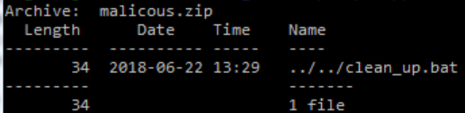

# ZipSlipDemo
This project is the coursework for the "Network Security 2" course for year 17/18, summer semester, FMI, SU by Mila Byankova 81146

## ZipSlip
The directory traversal vulnerability ZipSlip was published by Snyk Security team in 2018. 
It concerns the zip format and all other archiving formats that are based on it.
ZipSlip happens when a malicious zip containing one or more files with directory traversal 
filenames are extracted to outside the target directory.
This might add or replace files, opening up the possibility for a wide range of attacks.

## About the project
The purpose of this project is to demonstrate how an application, which works with zip files, can be vulnerable to ZipSlip. 
A very simple web application was created, containing a single form with a file type input and a submit button. When submitted, a copy of the zip file
is created on the local file system of the server in a directory named 'zipped'. Then it is unzipped in a directory 'unzipped' within a separate folder
named as the zip file. A cleanup batch file is called occasionally to delete archives that have already been unzipped. 

## Technologies and deployment
ZipSlipDemo is a simple project written in Java in eclipse. It contains a single servlet, a view and a unzipper helper class. The archive extraction is
done via the zip4j library. The application is meant to be deployed on a TomCat 8 server. 

## Demo
Once the project has been setup visit */FileUploader to see the zip uploader form. To see the system run normally upload the examples/ok.zip file.
This should result in the existence of a /unzipped/ok/text.txt file which was the only file in the zip. 
To see zipslip in action upload /examples/malicious.zip. 

This should result in the overwrite of the cleanup file and message that you've been hacked.
To restart the hack revert the cleanup file via git.

## Prevention
ZipSlip in itself is not a newly discovered vulnerability, but a legitimate use of the zip standard. 
Applications should not be run with privileges outside their domain in the first place. 
Other than that most articles about unzipping files and most libraries' documentation clearly state that
it's the developer's responsibility to validate the zip file names.
 
## Sources and useful materials
1. [https://snyk.io/research/zip-slip-vulnerability](https://snyk.io/research/zip-slip-vulnerability)
1. [https://threatpost.com/zip-slip-flaw-affects-thousands-of-open-source-projects/132577/](https://threatpost.com/zip-slip-flaw-affects-thousands-of-open-source-projects/132577/)
1. [http://www.lingala.net/zip4j/](http://www.lingala.net/zip4j/)
1. [https://wiki.sei.cmu.edu/confluence/display/java/IDS04-J.+Safely+extract+files+from+ZipInputStream](https://wiki.sei.cmu.edu/confluence/display/java/IDS04-J.+Safely+extract+files+from+ZipInputStream)

